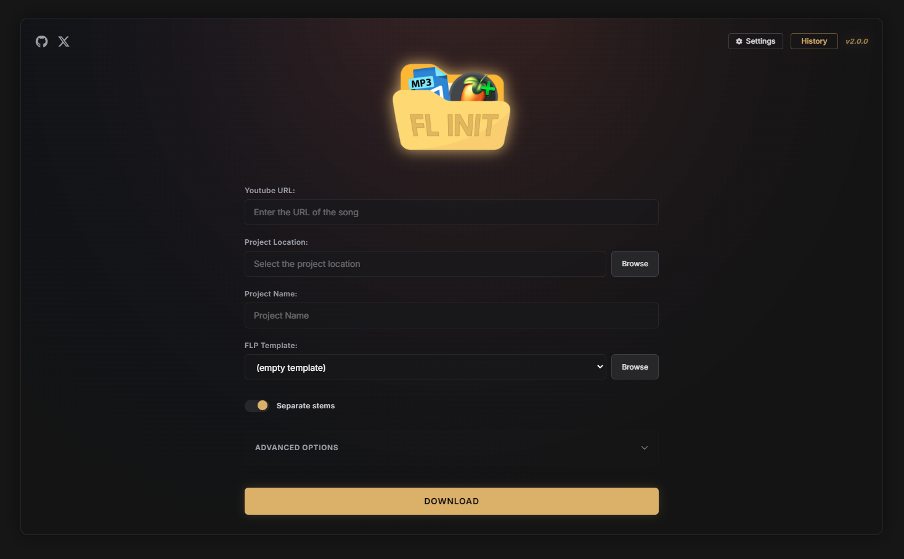

<p align="center">
  
</p>

<h1 align="center">FL-Init</h1>

<p align="center">
  <strong>Streamline your FL Studio workflow by automating project setup directly from YouTube tracks.</strong>
</p>

<p align="center">
  
  
  
  
</p>

---

## Overview

**FL-Init** is an Electron desktop application for Windows designed for music producers to accelerate their workflow when working with reference tracks. By simply pasting a YouTube link, the application handles the tedious process of downloading the audio, separate the stems, and setting up an FL Studio project using your favorite template.

## Key Features

*   **YouTube Audio Downloader**: Easily download reference tracks from YouTube and automatically convert them into high-quality `.wav` or `.mp3` audio.
*   **Automatic BPM & Key Detection**: Uses `librosa` chromagram analysis and onset envelope tracking to accurately estimate the key (e.g., C Minor) and tempo (BPM) of the track.
*   **FLP Project Templates**: Start your projects using your favorite FL Studio layout. Choose a custom `.flp` template, and the app will copy and customize it with the detected song metadata (Key and BPM written directly to the project comments) via `pyflp`.
*   **AI Stem Separation (Demucs)**: Extract clean stems (Vocals, Drums, Bass, and Melody/Other instruments) with a single click using Facebook's Demucs. It automatically detects and leverages your GPU/CUDA acceleration if available.
*   **Local Project History**: Keep track of your past project creations locally. You can easily view, search, delete, and reopen past projects right from the dashboard.
*   **Fully Standalone**: The production bundle compiles and packages its own portable Python 3.10.x environment. End users do not need to install Python, PyTorch, or PyFLP manually.

---

## 📸 Interface Preview

Here is a preview of the FL-Init dashboard:



---

## 🛠️ Tech Stack

*   **Main Process**: Electron 30.0.2, TypeScript, `electron-log`, `electron-updater`
*   **Renderer Process (Frontend)**: React 19, TypeScript, Webpack 5, Tailwind CSS, SweetAlert2
*   **Storage & Configuration**: Local JSON storage (`config.json` and `history.json`) managed securely via the Electron Main Process
*   **Python Engine**: Standalone embedded Python runtime utilizing:
    *   `pytubefix` (YouTube download)
    *   `librosa` (BPM & Key analysis)
    *   `pyflp` (FL Studio project manipulation)
    *   `demucs` (Stem separation)
    *   `torch` (CPU/GPU acceleration for ML inference)

---

## 📦 Installation & Setup

### For General Users
1. Go to the [Releases Page](https://github.com/spewite/FL-Init/releases).
2. Download the installer for your operating system (`FL-Init-Setup-x.x.x.exe` for Windows).
3. Run the installer and launch the application.

> [!NOTE]
> All dependencies, including Python, ffmpeg, and ML separation modules, are bundled with the installer. No external installation is required.

---

### For Developers

If you want to run the project in development mode or build it from source:

#### 1. Prerequisites
*   [Node.js](https://nodejs.org/) (Version 20.x or higher recommended)
*   [Git](https://git-scm.com/)

#### 2. Clone the Repository
```bash
git clone https://github.com/spewite/FL-Init.git
cd FL-Init
```

#### 3. Install NPM Dependencies
```bash
npm install
```

#### 4. Bootstrap Standalone Portable Python
We provide a setup script that automatically downloads, configures, and installs the required Python distribution and pip packages (`requirements.txt`) locally in the `dist/python` folder:
```bash
npm run build:python
```

#### 5. Run the Application in Development Mode
Launch the Webpack compilation and Electron simultaneously:
```bash
npm run dev
```

---

## 💻 Available NPM Commands

| Command | Description |
| :--- | :--- |
| `npm run dev` | Runs both renderer (via Webpack Dev Server) and Electron in hot-reload development mode. |
| `npm run build:python` | Automatically downloads, unzips, and bootstraps the embedded portable Python environment with requirements. |
| `npm run build` | Compiles TypeScript for the main process and Webpack assets for the renderer process. |
| `npm run start` | Compiles main process TS and runs the application in production mode. |
| `npm run pack` | Prepares the portable Python runtime, builds assets, and packages Electron app directories into unpacked formats. |
| `npm run dist` | Builds and creates standalone installer distributions (`NSIS` installer, etc.). |

---

## 📂 Project Structure

```
├── .agents/              # AI agent workspace configuration
├── assets/               # Production app icons and templates
├── build/                # NSIS installer configurations
├── docs/                 # Documentation pages and assets (used for GitHub pages)
│   ├── app.png           # App screenshot used in README
│   └── index.html        # GitHub Pages site
├── icons/                # High-res application icons (.ico, .png)
├── scripts/              # Setup and helper scripts
│   ├── setup-portable-python.js  # Script to download/bootstrap local portable Python
│   └── script_python.py          # Core Python audio analysis and FLP generation script
├── src/
│   ├── main/             # Electron Main Process (TypeScript)
│   ├── preload/          # Electron ContextBridge Preload Script (TypeScript)
│   ├── renderer/         # Webpack frontend source code (Vanilla JS)
│   └── shared/           # Common types and constants
├── templates/            # Base templates for FL Studio (.flp files)
├── package.json          # Node script and dependency configuration
├── requirements.txt      # Python libraries list (installed into the portable environment)
└── tsconfig.json         # TypeScript compiler configurations
```

---

## 🔒 Security Practices

FL-Init follows standard Electron security guidelines:
*   `contextIsolation` is enabled in all BrowserWindows.
*   Node.js integration is disabled in renderer processes.
*   Renderer-to-Main communication is bridged securely through `contextBridge` using limited, well-defined IPC channels.
*   All user arguments passed down to the Python process are validated.

## 📄 License

This project is proprietary. All rights are reserved. No part of this software may be copied, modified, distributed, or commercialized without the explicit written permission of the author. Refer to [LICENSE](file:///I:/Izeta/Documentos/Proyectos/FL-Init/LICENSE) for more details.